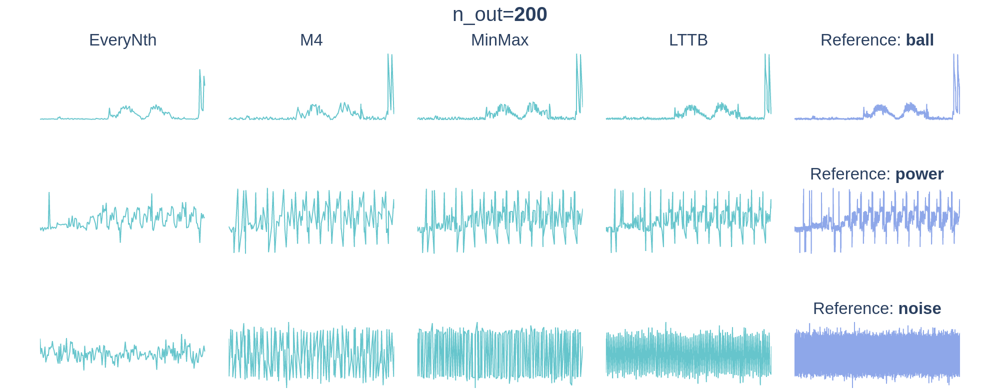
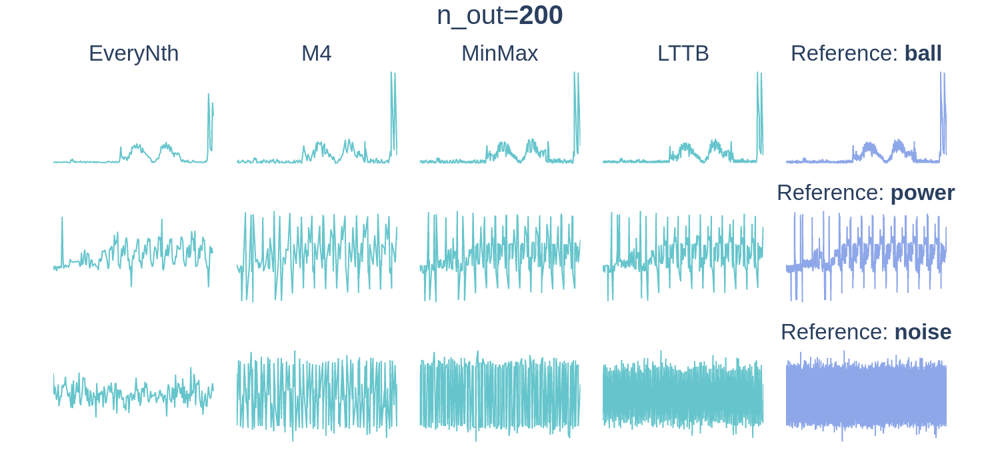

<!-- # :mag: data point selection for line chart visualization -->
<!-- center in a div -->

<div align="center">
<h1>:mag: Data Point Selection for Line Chart Visualization</h1>
</div>

<!-- <div align="center">
<h1>
    <p>Data Point Selection for Line Chart Visualization:</p>
    <p>Methodological Assessment and Evidence-Based Guidelines</p>
</h1>
</div> -->


<!-- Codebase & further details for the paper:  -->
<!-- > **Data Point Selection for Line Chart Visualization: Methodological Assessment and Evidence-Based Guidelines**   -->
<!-- > Jonas Van Der Donckt, Jeroen Van Der Donckt -->

<!--  -->
<!-- Embed the gif in html -->

<div align="center">

<br></br>
</div>

*Codebase & further details for the paper*:  
> **Data Point Selection for Line Chart Visualization: Methodological Assessment and Evidence-Based Guidelines**  
> Jonas Van Der Donckt, Jeroen Van Der Donckt

**Preprint**: https://arxiv.org/abs/2304.00900

## How is the repository structured?

- The codebase is located in the `agg_utils` folder.
- Additional details can be found in the respective README.md files in the `details` folder.
- Supplementary gifs can be found in the `gifs` folder.
- See [notebooks README](notebooks/) for the more details.
  - The `0.*` notebooks contain data parsing and figure generation.
  - The `1.*` notebooks performing the core experiments (visual representativeness and visual stability).
  - The `varia_*` notebooks perform further analysis: OR-conv, toolkit comparison, and M4 pixel-perfect nuances.

Folder structure
```txt
├── agg_utils          <- shared codebase for the notebooks
├── details            <- additional details in README.md files
├── gifs               <- supplementary gifs
├── loc_data           <- local data folder 
└── notebooks          <- experiment notebooks see notebooks README.md
```

## How to install the requirements?

This repository uses [poetry](https://python-poetry.org/) as dependency manager.  
A specification of the dependencies is provided in the [`pyproject.toml`](pyproject.toml) and [`poetry.lock`](poetry.lock) files.

You can install the dependencies in your Python environment by executing the following steps;
1. Install poetry: https://python-poetry.org/docs/#installation
2. Activate you poetry environment by calling `poetry shell`
3. Install the dependencies by calling `poetry install`

## Utilizing this repository

Make sure that you've extended the [path_conf.py](agg_utils/path_conf.py) file's hostname if statement with your machine's hostname and that you've configured the path to the UCR archive folder.


---

<p align="center">
👤 <i>Jonas & Jeroen Van Der Donckt</i>
</p>
