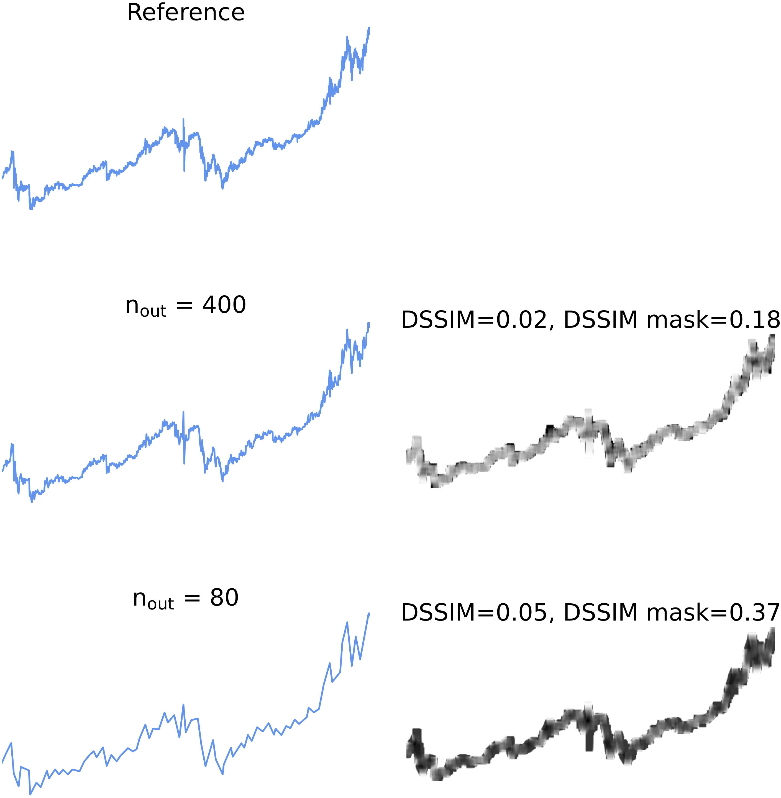

# OR-conv Masking

 As depicted in the figure below, the OR-convolution mask is generated by adding (OR operation) the downsampled and reference line charts, followed by convolving the resulting chart with a $11 \times 11$ kernel filled with ones. The binary mask is then obtained using the $> 0$ comparison.

> OR-conv masking applied on the (mean) DSSIM metric. An $n_{out}$ of 80 yields a non-masked DSSIM of $0.05$, whereas the masked DSSIM value has a value of $0.37$ nearing the non-correlation value (0.5).