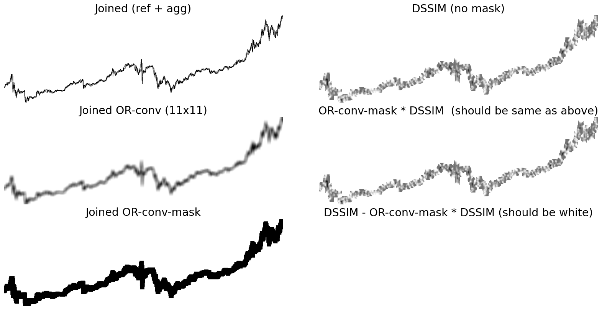

# OR-conv Masking

To accurately assess the performance of data point selection algorithms, it's important to test them on various time series templates. However, keep in mind that time series templates can differ in properties such as canvas filling surface. This can impact metrics that generate per-pixel values that are then aggregated. To address this issue, the `OR-conv mask` was developed. This mask normalizes the per-pixel metric by using the mask area, which helps to mitigate the effects of varying canvas filling surface.

The OR-convolution mask is generated by:
1. Adding (OR operation) the downsampled and reference line charts
2. Convolving the resulting chart with a $11 \times 11$ kernel filled with ones. 
3. The binary mask is obtained using the $> 0$ comparison.

```python
# Load the images, and only keep 1 channel
agg_img, ref_img = plt.imread('...')[:, :, dim], plt.imread('...')[:, :, dim]
# 1. Join the images
joined = agg_img + ref_img
# 2. Compute the or conv
or_conv = ss.convolve2d(joined, np.ones((win_size, win_size)), mode="same")
# 3. Compute the mask
or_conv_mask = or_conv > 0
```

The figure below is a similar illustration of applying the OR-convolution mask to the per-pixel DSSIM output. This illustration includes a sanity check of the mask being 0 when we subtract the OR-conv mask multiplied with the DSSIM metric from the DSSIM metric itself. The result is a chart filled with zeros, as expected.



---

The figure below demonstrate that the OR-conv mask allows obtaining a higher dynamic range for the per-pixel metrics.


> OR-conv masking applied on the (mean) DSSIM metric. An $n_{out}$ of 80 yields a non-masked DSSIM of $0.05$, whereas the masked DSSIM value has a value of $0.37$ nearing the non-correlation value (0.5).
