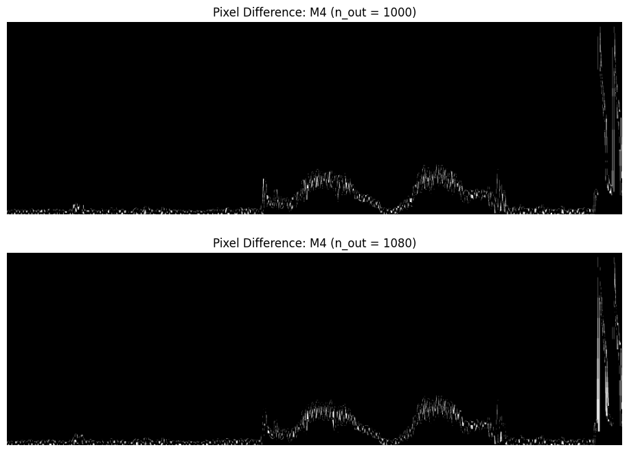

# Visual Representativity

This markdown file accompanies the interactive visualizations of the `Visual Representativity` section of the paper with some insights and explanations.

- [Image template grid & toolkit](#image-template-grid--toolkit)
- [Image template grid & line width](#image-template-grid--line-width)

#### Metrics & terms

- **$n_{out}$**: The number of datapoints in the aggregated image.
- **data-efficency**: The performance of a certain aggregator for a given (low) $n_{out}$.
- The metrics:
    - `MSE`: The conv-mask size mean-scaled Squared error
    - `PEM_20`: The conv-mask scaled ratio of, binary pixel errors between the reference and aggregation image(with a margin of 20).
    - `DSSIM`: The conv-mask scaled DSSIM error

### Image template grid & toolkit

**Note**: All visualizations utilize a line-width of 2 and linear interpolation. 
An interactive HTML of the visualization can be found [here](../animations/lw%3D2_default_frame%3Dtoolkits_aa.html)

**Insights**:
- The order of the aggregator trends is preserved among the different toolkits
- `LTTB` and `MinMax` seems to be the most data efficient aggregators.
  - LTTB seems to perform the best for the the power-50k template.
  - MinMax is the best algorithm for series with higher roughness e.g. the `Ball-50k` template
- There seems to be some instability in the M4 metrics for the `Ball-200k` template. 
    Analysis shows that is caused by the granularity of M4, slightly mismapping the reference image to the aggregated image. The screenshot below demonstrates that a lower n-out had a better mapping of this double peak at the end than a higher n_out (which utilized a lot of pixel space, hence it weighs a lot in the visual representativity metrics)
    
- aliasing causes the `PEM_20` to drop significanly
    
    - the anti-aliased figures seem to staturate at a `PEM_20` of .0.1, which is caused by the shading differences between the anti-aliasedaggregation and reference images. 
    - The MSE reinforces this statement, given that is does decrease significantly for the anti-aliased images, implying that the resulting errors can be attributed to (small) shading differences.

### Image template grid & line width

The employed toolkit is Plotly, using its default configurations i.e. a line width of 2 
and a linear interpolation. The metrics are computed using refrence images of the same line width. 
An interactive HTML of the visualization can be found [here](../animations/plotly_default_frame%3Dlw.html)

**Insights**:
- Increasing the line-width causes the metrics to decrease
- we observe some **inconsistencies** in the trend for the `plotly` and `bokeh` toolkit for lw=1. Specifically, for the `DSSIM` and `PEM_20` metrics. These inconsistencies are caused by the aggregation back-end for these toolkits and consecutive datapoint pixel column changes. Specifically the `DSSIM` error can be attributed to the aggregation backend interleaving small gaps for the reference error. 
    - The visualization below demonstrates how the matplotlib ref (middle subplot first row) does  not contain any empty areas, whereas the plotly reference visualization (muddle subplot second row) does contain empty areas, explaining hte high `DSSIM` error.
      <!-- N = 50k -->
    - The visualization below demonstrates how the `PEM_20` metric is affected by the datapoint pixel column mapping. We observe that fewer empty spaces are noticeable for the Plotly aggregation with n_out=1600 (left subplot first row) than for the aggregation (left subplot second row) with n_out=2320. This is caused by slight changes in datapoint to pixel-column mapping. Given that LTTB favors bin-centered datapoints, an `n_out` that is not a multitude of the canvas width will thus cause that the detapoints are not located in the same x-position of surrounding pixel-columns, resulting in more empty spaces (until n_out increases more so that the empty spaces will be again filled in)
      <!-- N = 50k -->
